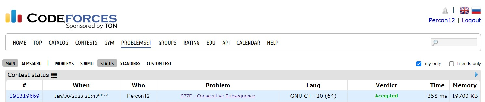
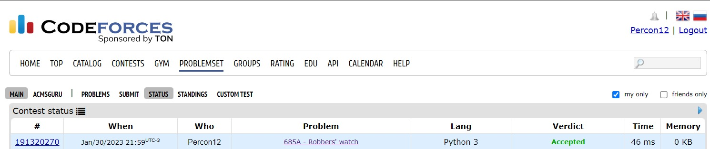

# DP_Dupla19_Exercicios

**Número da Lista**: 5  
**Conteúdo da Disciplina**: Programação Dinamica  

## Alunos
|Matrícula | Aluno |
| -- | -- |
| 18/0113259  |  Felipe Correia Andrade |
| 18/0127535  |  Mateus Brandão Teixeira |

## Sobre 
Resolução dos exercicíos (CodeForce) do conteudo de programação dinamica

## Screenshots
1- [Stars Drawing](https://codeforces.com/problemset/problem/1015/E1)

2- [Consecutive Subsequence](https://codeforces.com/problemset/problem/977/F?csrf_token=eaa8ac824e19291fc9a96a483b810797)

3- [Robbers' watch](https://codeforces.com/problemset/problem/685/A)

## Instalação 
**Linguagem**: C++ e Python3 

